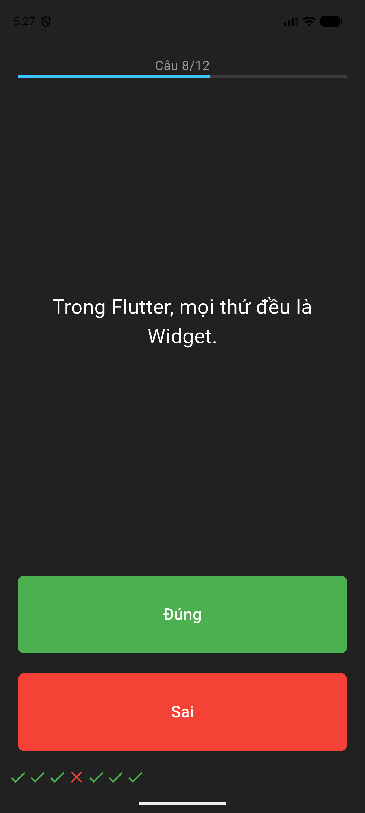

# Lab 6: Quizzler

Trò chơi câu đố Đúng/Sai.

## Chức năng

- Class `Question` định nghĩa câu hỏi, class `QuizBrain` quản lý danh sách câu hỏi.
- Nút xanh **Đúng**, nút đỏ **Sai**; kết quả mỗi câu được thêm vào `scoreKeeper` (✔ / ✘).
- Thanh tiến độ, hộp thoại tổng kết và tự động bắt đầu lại khi hết câu hỏi.

## Cấu trúc chính

- `lib/main.dart`
- `lib/question.dart`
- `lib/quiz_brain.dart`

## Chạy ứng dụng

```bash
flutter pub get
flutter run
```

## Demo


